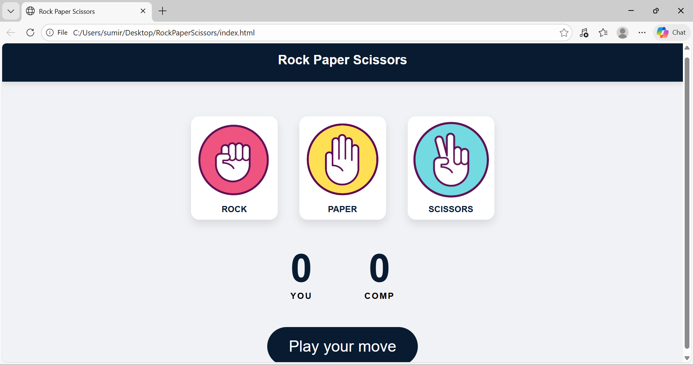

# Rock Paper Scissors Game

A sleek, interactive, and responsive Rock Paper Scissors game built with HTML5, CSS3, and Vanilla JavaScript. 




## 🚀 Features
- **Smooth Animations:** Includes hover effects, click scaling, and score "pop" animations.
- **Dynamic Feedback:** The background color of the message bar changes based on the outcome (Green for Win, Brown for Loss, Gray for Draw).
- **Responsive Logic:** Uses a clean conditional logic system to determine winners and update the score in real-time.
- **Responsive Design:** Optimized for various screen sizes.

## 🛠️ Technologies Used
- **HTML5:** Semantic structure for the game board.
- **CSS3:** Custom styling, Flexbox layouts, and CSS Transitions.
- **JavaScript (ES6):** DOM manipulation, event listeners, and game logic.

## 🎮 How to Play
1. Click on one of the three options: **Rock**, **Paper**, or **Scissors**.
2. The computer will randomly generate its own choice.
3. The winner is decided based on standard rules:
   - Rock beats Scissors.
   - Paper beats Rock.
   - Scissors beats Paper.
4. The score updates automatically and the message bar displays the result.

## 📂 Project Structure
```text
├── Images/          # Contains rock.png, paper.png, Scissors.png, Preview.png
├── index.html       # Main HTML structure
├── style.css        # Custom styles and animations
├── app.js           # Game logic and score tracking

